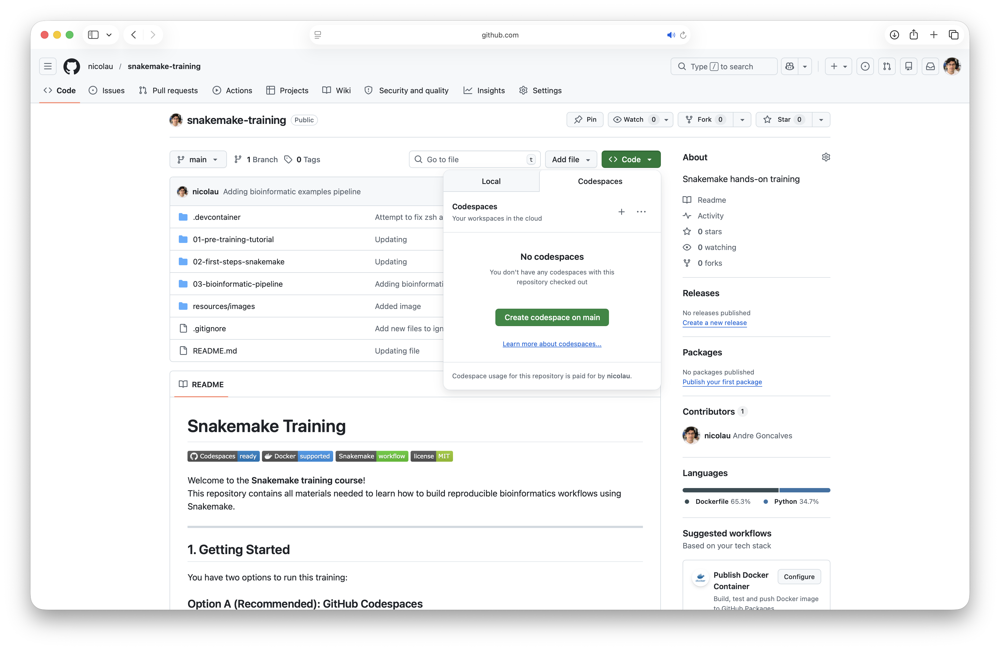

# Snakemake Training


Welcome to the **Snakemake training course**!  
This repository contains all materials needed to learn how to build reproducible bioinformatics workflows using Snakemake.

---

## Index:
- [1. Getting Started](#1-getting-started)
- [2. Pre-training Check](#-2-pre-training-check)
- [3. Training Content](#3-training-content)
- [4. RNA-seq Pipeline](#4-rna-seq-pipeline)
- [5. Exercises](#5-exercises)
- [6. Useful Commands](#6-useful-commands)
- [7. Repository Structure](#7-repository-structure)
- [Troubleshooting](#troubleshooting)
- [Instructor Notes](#-instructor-notes)
- [Glossary](#glossary)
- [Resources](#-resources)

---

## 1. Getting Started

You have two options to run this training:

### Option A (Recommended): GitHub Codespaces

No installation required — everything runs in your browser.

#### 1. Click **Code** → **Codespaces** → **Create codespace on main branch**


#### 2. Wait for the environment to build


#### 3. In the terminal run:

```bash
conda activate snakemake_training
snakemake --version
```

#### 4. What result is expected:

```bash
9.16.2
```

If this works, you're ready to go.

---

### Option B: Local Docker Setup

Use this if you prefer running locally.

#### 1. Install Docker

- Install Docker Desktop (Windows/Mac) or Docker Engine (Linux) following instructions from https://www.docker.com/.

#### 2. Clone this repository

In your local machine terminal, run:
```bash
git clone https://github.com/nicolau/snakemake-training.git
cd snakemake_training
```

If have any problems with permissions, try:
```bash
git config --global --unset credential.helper
```
Then try cloning again.

#### 3. Build a Docker image

```bash
cd .devcontainer
docker build -t snakemake_image .
```

#### 4. List of Docker images to confirm build

```bash
docker images
```

#### 5. Start a Docker container

```bash
cd ../..

docker run -itd -v $(pwd):/workspace -w /workspace/snakemake-training --name snakemake_container snakemake_image:latest /bin/bash
```

#### 6. Access terminal from Docker container
```bash
docker exec -it snakemake_container /bin/bash
```

#### 7. Activate and test Snakemake environment

```bash
conda activate snakemake_training
snakemake --version
```

#### 8. What result is expected:

```bash
9.16.2
```

[Return to Index](#index)

---

## 🧪 2. Pre-training Check

Before starting, make sure everything works.

### Run a test workflow

```bash
cd 01-pre-training-tutorial

cd 01-first-step

snakemake -n results/output.txt
```

Expected result
```bash
host: codespaces-9c361c
Building DAG of jobs...
Job stats:
job           count
----------  -------
first_step        1
total             1


[Fri Apr  3 11:41:43 2026]
rule first_step:
    output: results/output.txt
    jobid: 0
    reason: Missing output files: results/output.txt
    resources: tmpdir=<TBD>
Job stats:
job           count
----------  -------
first_step        1
total             1

Reasons:
    (check individual jobs above for details)
    output files have to be generated:
        first_step
This was a dry-run (flag -n). The order of jobs does not reflect the order of execution.
```

Then execute
```bash
snakemake -j 1 results/output.txt
```

Expected result
```bash
Assuming unrestricted shared filesystem usage.
host: codespaces-9c361c
Building DAG of jobs...
Using shell: /usr/bin/bash
Provided cores: 1 (use --cores to define parallelism)
Rules claiming more threads will be scaled down.
Job stats:
job           count
----------  -------
first_step        1
total             1

Select jobs to execute...
Execute 1 jobs...

[Fri Apr  3 11:45:13 2026]
localrule first_step:
    output: results/output.txt
    jobid: 0
    reason: Missing output files: results/output.txt
    resources: tmpdir=/tmp
[Fri Apr  3 11:45:13 2026]
Finished jobid: 0 (Rule: first_step)
1 of 1 steps (100%) done
Complete log(s): /workspaces/snakemake-training/01-pre-training-tutorial/01-first-step/.snakemake/log/2026-04-03T114513.043293.snakemake.log
```

### Generate DAG

```bash
snakemake --dag | dot -Tpdf > dag.pdf
```

👉 Check:
- No errors
- Output files are created
- DAG looks correct

[Return to Index](#index)

---

## 3. Training Content

### 3.1 What should you expect to learn?
Imagining you are in a airplane falling into ground and the pilot cant fly the plane, you are the only one who can save the plane, you have to learn how to fly the plane in 30 minutes, you have no experience in flying. You don't need to know all the possible controls and features to fly a plan using all areodynamics power.


Instead, you need to know the basic controls to keep the plane flying and land it safely. This is what we will do with Snakemake, we will learn the basic controls to keep our workflow flying and land it safely.

### 3.2 Basic Snakemake Concepts

You will learn:

- What is a **rule**
- How `input` and `output` work
- How dependencies are inferred
- Introduction to **wildcards**

Example:

- Concatenating two files into one output

---

### 3.3 Different Execution Modes

We will explore:

- `shell:` → simple commands
- `script:` → Python/R scripts
- `wrapper:` → reusable tools

---

### 3.4 Key Concepts

- Rule dependencies
- Wildcards
- Config files
- Logs and resources

[Return to Index](#index)

---

## 4. RNA-seq Pipeline

You will build a simplified RNA-seq workflow:

1. **Quality Control**
   - FastQC

2. **Read Trimming**
   - Trimmomatic

3. **Quantification**
   - Salmon

4. **Aggregation**
   - Combine results into a count matrix

5. **Reporting**
   - MultiQC

[Return to Index](#index)

---

## 5. Exercises

### Exercise 1
Replace **Trimmomatic** with **fastp**

### Exercise 2
Add:
- FastQC
- MultiQC

### Optional Challenges

- Add new samples
- Use a `config.yaml`
- Add threads/resources
- Convert a rule to a script

[Return to Index](#index)

---

## 6. Useful Commands

```bash
# Dry run
snakemake -n

# Run workflow
snakemake -j 4

# Print commands
snakemake -p

# Generate DAG
snakemake --dag | dot -Tpdf > dag.pdf

# Force rerun
snakemake -F
```

[Return to Index](#index)

---

## 7. Repository Structure

```
.
├── pre_training/
├── basic_examples/
├── rnaseq_pipeline/
├── config/
├── data/
└── README.md
```

[Return to Index](#index)

---

## Troubleshooting

### Snakemake not found
→ Activate environment:

```bash
micromamba activate snakemake
```

### DAG command fails
→ Install graphviz:

```bash
micromamba install graphviz
```

### Permission issues (Docker)
→ Try:

```bash
chmod -R 777 .
```

[Return to Index](#index)

---

## 👨‍🏫 Instructor Notes

- Start simple: one rule, one output
- Let students run something early
- Build complexity gradually
- Encourage experimentation

[Return to Index](#index)

---

## Glossary

Conda environment command lines:

```bash
# List the conda environment available
conda env list
# Create a new conda environment from a YAML file
conda env create -f environment.yaml
# Activate the conda environment
conda activate snakemake_training
# Deactivate the conda environment
conda deactivate
# Install a package in the current conda environment
conda install package_name
# List installed packages in the current conda environment
conda list
# Remove a conda environment
conda env remove -n snakemake_training
# Update an existing conda environment with a YAML file
conda env update -f environment.yaml
```

[Return to Index](#index)

---

## 📚 Resources

- Snakemake docs: https://snakemake.readthedocs.io
- Snakemake wrappers: https://snakemake-wrappers.readthedocs.io
- Bioconda: https://bioconda.github.io

[Return to Index](#index)

---

## 🙌 Acknowledgments

This training is designed to introduce reproducible bioinformatics workflows using modern tooling such as:

- Snakemake
- Conda/Mamba
- Docker
- GitHub Codespaces

[Return to Index](#index)