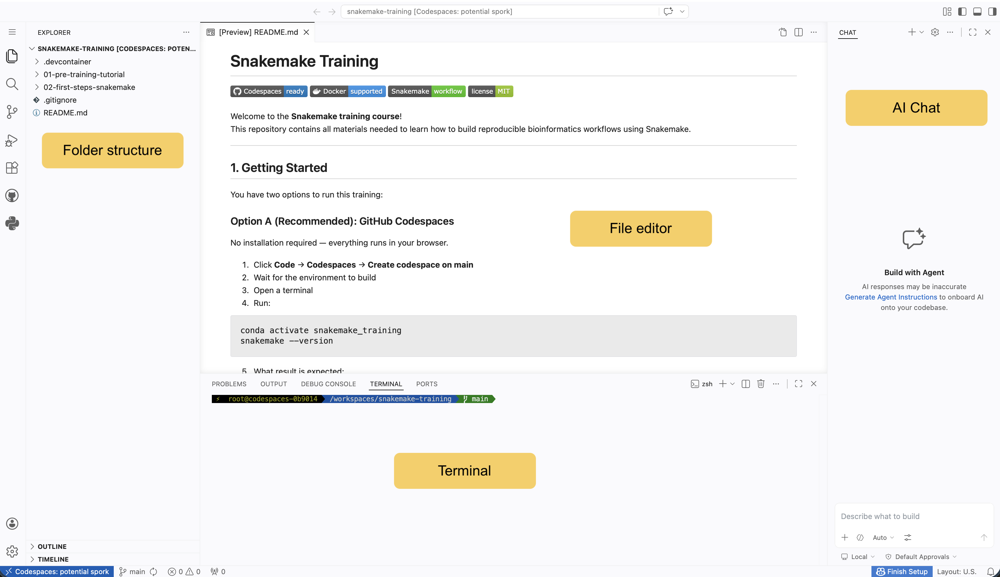

# Snakemake Training


Welcome to the **Snakemake training course**!  
This repository contains all materials needed to learn how to build reproducible bioinformatics workflows using Snakemake.

---

## 1. Getting Started

You have two options to run this training:

### Option A (Recommended): GitHub Codespaces

No installation required — everything runs in your browser.

#### 1. Click **Code** → **Codespaces** → **Create codespace on main**
#### 2. Wait for the environment to build



#### 3. Open a terminal
#### 4. Run:

```bash
conda activate snakemake_training
snakemake --version
```

#### 5. What result is expected:

```bash
9.16.2
```

If this works, you're ready to go.

---

### Option B: Local Docker Setup

Use this if you prefer running locally.

#### 1. Install Docker
- Install Docker Desktop (Windows/Mac) or Docker Engine (Linux) following https://www.docker.com/.

#### 2. Clone this repository

```bash
git clone https://github.com/nicolau/snakemake_training.git
cd snakemake_training
```

#### 3. Build a Docker image

```bash
docker build -f .devcontainer/Dockerfile -t snakemake_image .
```

#### 4. Start a Docker container

```bash
docker run -itd \
  -v $(pwd):/workspace \
  -w /workspace \
  --name snakemake_container \
  snakemake_image:latest /bin/bash
```

#### 5. Access terminal from Docker container
```bash
docker exec -it snakemake_container /bin/bash
```

#### 6. Activate and test Snakemake environment

```bash
conda activate snakemake_training
snakemake --version
```

#### 7. What result is expected:

```bash
9.16.2
```

---

## 🧪 2. Pre-training Check

Before starting, make sure everything works.

### Run a test workflow

```bash
cd 01-pre-training-tutorial/01-first-step
snakemake -n results/output.txt
```

Expected result
```bash
host: codespaces-9c361c
Building DAG of jobs...
Job stats:
job           count
----------  -------
first_step        1
total             1


[Fri Apr  3 11:41:43 2026]
rule first_step:
    output: results/output.txt
    jobid: 0
    reason: Missing output files: results/output.txt
    resources: tmpdir=<TBD>
Job stats:
job           count
----------  -------
first_step        1
total             1

Reasons:
    (check individual jobs above for details)
    output files have to be generated:
        first_step
This was a dry-run (flag -n). The order of jobs does not reflect the order of execution.
```

execute
```bash
snakemake -j 1 results/output.txt
```

Expected result
```bash
Assuming unrestricted shared filesystem usage.
host: codespaces-9c361c
Building DAG of jobs...
Using shell: /usr/bin/bash
Provided cores: 1 (use --cores to define parallelism)
Rules claiming more threads will be scaled down.
Job stats:
job           count
----------  -------
first_step        1
total             1

Select jobs to execute...
Execute 1 jobs...

[Fri Apr  3 11:45:13 2026]
localrule first_step:
    output: results/output.txt
    jobid: 0
    reason: Missing output files: results/output.txt
    resources: tmpdir=/tmp
[Fri Apr  3 11:45:13 2026]
Finished jobid: 0 (Rule: first_step)
1 of 1 steps (100%) done
Complete log(s): /workspaces/snakemake-training/01-pre-training-tutorial/01-first-step/.snakemake/log/2026-04-03T114513.043293.snakemake.log
```

### Generate DAG

```bash
snakemake --dag | dot -Tpdf > dag.pdf
```

👉 Check:
- No errors
- Output files are created
- DAG looks correct

---

## 3. Training Content

### 3.1 Basic Snakemake Concepts

You will learn:

- What is a **rule**
- How `input` and `output` work
- How dependencies are inferred
- Introduction to **wildcards**

Example:

- Concatenating two files into one output

---

### 3.2 Different Execution Modes

We will explore:

- `shell:` → simple commands
- `script:` → Python/R scripts
- `wrapper:` → reusable tools

---

### 3.3 Key Concepts

- Rule dependencies
- Wildcards
- Config files
- Logs and resources

---

## 4. RNA-seq Pipeline

You will build a simplified RNA-seq workflow:

1. **Quality Control**
   - FastQC

2. **Read Trimming**
   - Trimmomatic

3. **Quantification**
   - Salmon

4. **Aggregation**
   - Combine results into a count matrix

5. **Reporting**
   - MultiQC

---

## 5. Exercises

### Exercise 1
Replace **Trimmomatic** with **fastp**

### Exercise 2
Add:
- FastQC
- MultiQC

### Optional Challenges

- Add new samples
- Use a `config.yaml`
- Add threads/resources
- Convert a rule to a script

---

## 6. Useful Commands

```bash
# Dry run
snakemake -n

# Run workflow
snakemake -j 4

# Print commands
snakemake -p

# Generate DAG
snakemake --dag | dot -Tpdf > dag.pdf

# Force rerun
snakemake -F
```

---

## 7. Repository Structure

```
.
├── pre_training/
├── basic_examples/
├── rnaseq_pipeline/
├── config/
├── data/
└── README.md
```

---

## Troubleshooting

### Snakemake not found
→ Activate environment:

```bash
micromamba activate snakemake
```

### DAG command fails
→ Install graphviz:

```bash
micromamba install graphviz
```

### Permission issues (Docker)
→ Try:

```bash
chmod -R 777 .
```

---

## 👨‍🏫 Instructor Notes

- Start simple: one rule, one output
- Let students run something early
- Build complexity gradually
- Encourage experimentation

---

## 📚 Resources

- Snakemake docs: https://snakemake.readthedocs.io
- Snakemake wrappers: https://snakemake-wrappers.readthedocs.io
- Bioconda: https://bioconda.github.io

---

## 🙌 Acknowledgments

This training is designed to introduce reproducible bioinformatics workflows using modern tooling such as:

- Snakemake
- Conda/Mamba
- Docker
- GitHub Codespaces
